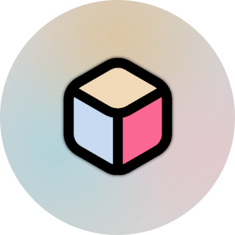
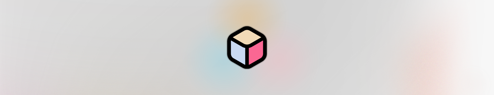

<h2 align="left">Welcome to my game Squareo, I'm Yahya Amarneh</h2>

###

###

  
  
  
  
  
  
  

###

  
  
  

###

 

<h1 align="center">Squareo</h1>

###

  

###

<h2 align="left">Introduction</h2>

###

Welcome to Squareo, an engaging mobile puzzle game where your objective is to restore a grid of squares to its original state. The grid moves over time, adding a challenging twist that tests your memory, spatial awareness, and problem-solving skills.

###

<h2 align="left">Game Objective</h2>

###

The primary goal of Squareo is to reposition each square on the grid back to its original location. The faster and more efficiently you do this, the higher your score and grade.

###

<h2 align="left">Controls</h2>

###

• Drag: Move the selected square to the desired location. • Release: Place the square in the new position.

###

<h2 align="left">Scoring and Grading</h2>

###

Your performance in Squareo is evaluated based on two main factors: the number of moves you make and the time it takes to complete the puzzle. Here’s how the grading works:  • A+: Exceptional performance (fewest moves and shortest time). • A: Excellent performance (slightly more moves and time than A+). • A-: Very good performance. • B+: Good performance. • B: Above average performance. • B-: Average performance. • C+: Below average performance. • C: Poor performance. • C-: Very poor performance.  • D: Needs improvement.

###

<h2 align="left">User Interface</h2>

###

The user interface is designed to be intuitive and user-friendly:  • Main Menu: Start a new game, select level,  view scores. • Game Screen: Displays the grid, bottom sheet for (back to menu, restart level, skip level). • Win Dialog: Display time, moves , points gained, grade , buttons for (back to menu, restart level, skip level). • Customize: allowing you change your grid as you like.

###

<h2 align="left">Credits</h2>

###

Squareo is developed by Yahya Amarneh. I hope you enjoy playing my game as much as I enjoyed creating it. For support or feedback, please contact us above.

###
